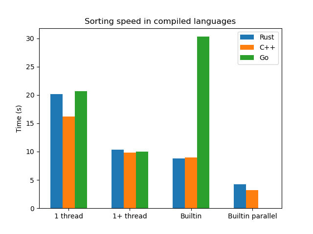

# Sorting Benchmarks

These are speed benchmarks of merge sort algorithm implemented in Rust, C++ and Go.

The goal was to compare speed and efficiency of optimizations done by 3 most popular compiled
languages. The algorithm implementations in all 3 languages are kept as similar as possible by the means of said languages.
As a reference point, results are compared to those of the built-in sort versions (which, however, implement algorithms other than merge sort).

## Installation

Dependencies: 

- GNU Make
- GNU g++
- libpthread
- openmp
- rust suite (cargo, rustc, etc.)
- go

```bash
git clone https://github.com/lyova-potyomkin/sort-bench.git
cd sort-bench
make
```

## Results

**Benchmark setup:**

1. Each configuration was ran 25 times (to reduce the error) against an array of 100 million `int`s.

2. For each language, arrays are generated randomly, with a fixed seed.

3. Sequential fallback was implemented (parallel implementations use sequential ones, once array size is small enough, 2<sup>13</sup> here). Without it, programs struggle take much, MUCH longer to finish (since there are so many threads), and in the case of Go, freeze my computer and do not finish at all.

4. CPU: Intel i5-3320M (4 cores) @ 3.3GHz

5. OS: Arch Linux (kernel version 5.5)

| Implementation | C++ | Rust | Go |
| --- | --- | --- | --- |
| Single-threaded  | 16.16s | 20.12s | 20.69s |
| Multi-threaded   | 9.86s  | 10.34s | 10.00s |
| Built-in         | 9.00s  | 8.82s  | 30.29s |
| Built-in parallel | 3.21s | 4.25s  | --     |



## Conclusions

1. Go's built-in sort is weirdly slow.
2. If not using Go, you are better off with a built-in implementation.
3. It is good to utilize all of your cores.
4. Unfortunately, sequential fallbacks are still necessary everywhere.

